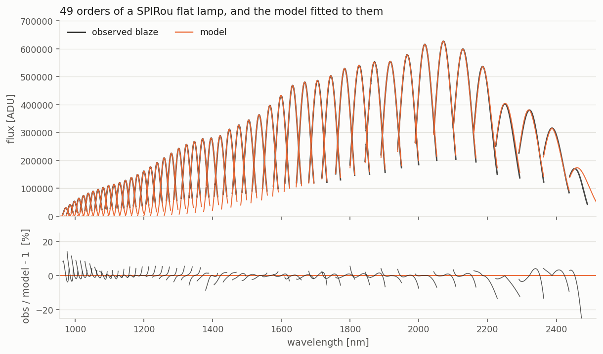
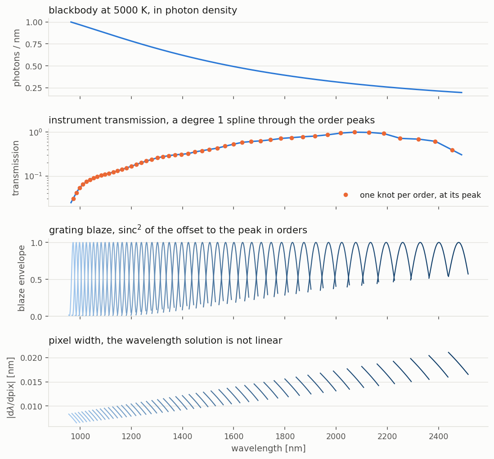
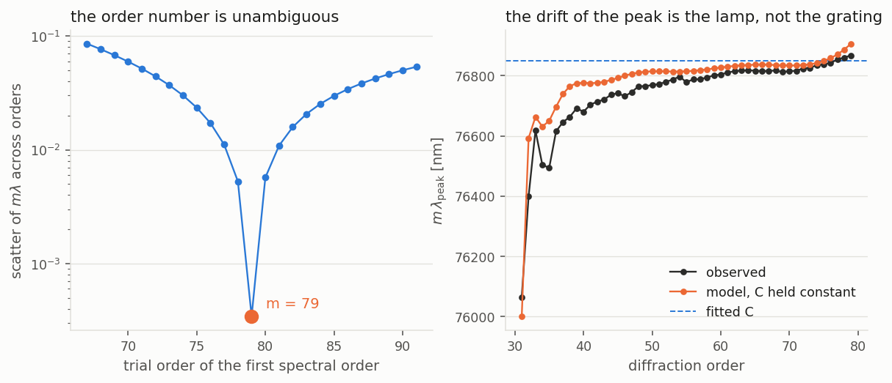
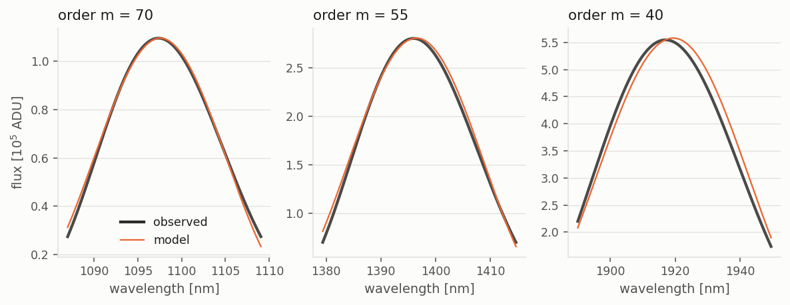

# blaze

A physical model of the blaze function of an échelle spectrograph, fitted to a
flat-lamp exposure. Instead of smoothing the observed flat, the code builds the
blaze out of the pieces that actually produce it (lamp spectrum, instrument
transmission, grating diffraction, detector sampling) and fits the few free
parameters of that description.

Nothing is hard-coded for a particular instrument. The diffraction orders are
read off the wavelength solution, and the grating constants are fitted. The
example data shipped here is SPIRou (CFHT), reduced with APERO.

The full characterisation, with an MCMC of the grating parameters, is written
up in [`report/blaze_report.pdf`](report/blaze_report.pdf).



*49 orders of a flat lamp, the model on top of them, and what is left over. One
set of parameters for the whole array: no per-order normalisation, no smoothing.*

---

## The model

For diffraction order `m` and pixel `i`:

```
model(m, i) = BB_photon(lambda, Teff) x Trans(lambda) x sinc^2(blaze) x dlambda/dpixel
```

| term | what it is | why it matters |
|---|---|---|
| `BB_photon` | blackbody of the calibration lamp, in **photon** density: `1 / (lambda^4 (exp(hc/lambda.k.T) - 1))` | the detector counts photons, not energy. Using `B_lambda` instead shifts the peak of the lamp spectrum by hundreds of nm |
| `Trans` | `log(transmission)` as a linear spline through the peaks of the orders (default), or as a polynomial. It carries the global amplitude | filters, coatings, fibre and detector QE. It is by far the largest term, a factor of ~30 across the SPIRou range |
| `sinc^2` | single-groove diffraction envelope of the grating | the blaze proper, the only term that knows about `m` |
| `dlambda/dpixel` | width of a pixel in wavelength | the wavelength solution is not linear, so this varies by ~28% along a SPIRou order and tilts every one of them |



*The four terms, on the same wavelength axis. Only the third one knows about the
diffraction order. Colour runs from the bluest order to the reddest.*

### The grating envelope

The natural variable of the blaze function is the distance to the blaze peak
counted **in orders**. With `e = m.lambda / C - 1`, which is 0 at the peak and
about `+-1/m` at the edges of an order,

```
blaze = sinc^2( beta . m . (e + asym . e^2) )      with    m . lambda_blaze = C
```

`C = 2 d sin(theta_b) cos(gamma)` is the grating spacing as the beam sees it:
the optical path difference between two adjacent grooves at the blaze peak.

`beta` scales the width of the envelope. `beta = 1` means a fully illuminated
groove, i.e. the first zeros of the `sinc^2` fall exactly one free spectral
range away from the peak.

`asym` makes the envelope lopsided in wavelength. Expanding the exact grating
equation in Littrow gives `asym = tan(theta_b)^2 / 2 - 1`, so in principle it
measures the blaze angle. It is left free because the data do not follow that
relation, see the limitations.

### A chromatic C

`C` is not quite the same for every order:

```
C(lambda) = a0 + a1 . lambda
```

The grooves are the same for all orders, but the angle `gamma` at which the
beam meets them need not be. SPIRou's cross-disperser, a train of two ZnSe
prisms and one Infrasil prism, is used in **double pass**: the beam crosses it
once before the échelle and once after
([Donati et al. 2020](https://arxiv.org/pdf/2008.08949)). It therefore reaches
the grating already dispersed, `gamma` depends on wavelength, and so does
`C = 2 d sin(theta_b) cos(gamma)`. On SPIRou the fit finds `C` decreasing by
0.23% from 965 to 2490 nm, and the result is the same whether the transmission
is a spline or a polynomial (-0.228% and -0.229%). With `C` held constant, the
observed peaks sit 50 to 200 pixels bluer than the model across the red half of the array.

### The transmission

Each order contributes one spline knot, placed at its observed peak. The knot is
the median, over +-50 pixels around the peak, of

```
log(observed) - log(BB_photon x sinc^2 x dlambda/dpixel)
```

that is, the observed peak with the other three terms taken out first. They have
to come out: the peak flux also carries the lamp, the blaze and the pixel width,
and would count them twice otherwise. The knots are joined by straight lines in
`log(transmission)`, and the end segments carry on beyond the first and last
knot.

A polynomial is still available (`TRANSMISSION = 'poly'`). The spline is the
default because it is better where it counts, see [Spline or
polynomial](#spline-or-polynomial) below.

### Free parameters

Four non-linear parameters: the two coefficients of `C(lambda)`, `beta` and
`asym`. Inside the fit, `C` is written around a reference wavelength, the
median of the fitted pixels, so that its two coefficients are not correlated;
`a0` and `a1` are derived from them. The transmission never goes through the
non-linear solver: the spline knots are read straight off the
data for the current grating parameters, and a polynomial would be solved by
linear least squares, since `log(transmission)` enters linearly. The fit takes
about a second on a 49 x 4088 array and is followed by two passes of sigma
clipping.

---

## Finding the diffraction orders

`mkblaze.py` works out the real diffraction order of each spectral order, which
is normally not stored in extracted data. Two independent methods, which agree:

1. **Order overlap**, wavelength solution only, no blaze needed. At a given
   pixel all orders share the same diffraction angle, so `m.lambda` is the same
   for all of them and `m = lambda / |dlambda/dorder|` directly.
2. **Flatness of `m.lambda_blaze`**. Scan the integer offset and keep the value
   that makes the product across orders the flattest.

On the included data both give orders **79 (bluest) down to 31 (reddest)**, the
published SPIRou numbering. The flatness criterion is unambiguous: relative
scatter `1.8e-3` for the best offset against `4.0e-3` for the runner-up.



*Left: the scatter of `m.lambda` against the trial order number, more than a
decade deep at the right answer. Right: `m.lambda_peak` drifts by ~800 nm across
the array. Part of it is the chromatic `C` (dashed), the rest is the slope of
the lamp spectrum pulling each observed maximum off the true blaze peak. The
model reproduces both.*

`fit_blaze.py` has this built in as `diffraction_orders()`. It handles orders
stored either way round (blue to red or red to blue) and a subset of the array.

---

## Quick start

```bash
pip install numpy scipy astropy matplotlib
python mkblaze.py                 # identify the diffraction orders
python fit_blaze.py               # fit the model
python fit_blaze.py myblaze.fits mywave.fits    # any other instrument
```

Both files are 2D arrays of the same shape, `(n_orders, n_pixels)`: the
extracted flat-lamp spectrum and its wavelength solution. NaNs are ignored.

## Full characterisation

`characterize.py` runs everything: the order identification, the fit, an MCMC
of the grating parameters, a jackknife over orders, profile tests and a
comparison of transmission models. It then writes a LaTeX report,
[`report/blaze_report.pdf`](report/blaze_report.pdf).

```bash
pip install numpy scipy astropy matplotlib emcee corner
python characterize.py                    # analysis + figures + PDF report (about 15 min)
python characterize.py --no-report        # analysis only, summary printed, no figures, no LaTeX
python characterize.py --report-only      # rebuild figures and PDF from existing results
python characterize.py --no-report --instrument SPIRou       # one configured instrument
python characterize.py --no-report --skip-comparison         # skip the model comparison
python characterize.py --no-report --name MYINST \
        --blaze myblaze.fits --wave mywave.fits [--littrow-tan 2]   # any other instrument
```

| mode | what it does | needs |
|---|---|---|
| default | analysis of SPIRou and NIRPS, figures, compiled report | both instruments' files, `pdflatex`, `bibtex` |
| `--no-report` | analysis only, prints the posterior, jackknife and tests; results in `report/work/<instrument>/` | the files of the instruments analysed |
| `--report-only` | figures and PDF from the results already in `report/work/` | a previous full run |

The report is written for SPIRou and NIRPS together, so building it needs the
NIRPS files, which are **not** in this repository. Without them, use
`--no-report`: the analysis of SPIRou, or of any instrument given with
`--name/--blaze/--wave`, runs on its own. `--littrow-tan` is the tangent of the
nominal blaze angle and only enables the Littrow asymmetry test.

### MCMC results

Posterior median and 68% half-width, with the jackknife uncertainty in
brackets. `C(lref)` is in nm at the reference wavelength (1496 nm for SPIRou,
1336 nm for NIRPS), `dC/dlambda` in nm per nm, and `Delta C` is the change of
`C` across the array, in %.

| | `C(lref)` | `dC/dlambda` | `beta` | `asym` | `Delta C` |
|---|---|---|---|---|---|
| **SPIRou** | 76802.0 +- 1.4 (2.2) | -0.1070 +- 0.0026 (0.0044) | 0.8560 +- 0.0008 (0.0011) | -3.45 +- 0.19 (0.32) | -0.212 +- 0.005 (0.009) |
| **NIRPS** | 145026.0 +- 1.7 (2.3) | -0.0748 +- 0.0043 (0.0058) | 0.8584 +- 0.0014 (0.0032) | 5.51 +- 0.60 (0.89) | -0.051 +- 0.003 (0.004) |

* The chromatic term is detected at 24 sigma on SPIRou and 13 sigma on NIRPS,
  even with the jackknife uncertainties. Forcing `C` constant costs
  `Delta ln L` = 268 and 100.
* The jackknife uncertainties are 1.4 to 2.3 times the MCMC ones: quote those.
* The lamp temperature is not constrained: from 2500 to 30000 K the
  log-likelihood spans less than 0.4 and no grating parameter moves by more
  than 0.12 of its uncertainty.

What the MCMC does, briefly: the residuals of the model are correlated over
~600 pixels along an order and have heavy tails, so the likelihood is a
Student-t on the log residual, tempered by the correlation length so that
pixels are not counted as independent. The transmission is profiled at every
step. The report compares the posterior widths with a jackknife over orders,
which does not depend on that tempering.

## What comes out

| file | content |
|---|---|
| `blaze_model.fits` | the model spectrum, same shape as the input, fitted parameters in the header (`MODCA0`, `MODCA1`, `MODBETA`, `MODASYM`, ...) and the spline knots in a `TRANS_KNOTS` table |
| `blaze_model_debug.pdf` | 4 pages: observed vs model over the whole range, the model components separated, a panel per order, and the peak-drift check |
| `blaze_orders.pdf` | the order identification from `mkblaze.py` |

The figures in this README are built separately by `docs/make_figures.py`, which
rebuilds the model from the header of `blaze_model.fits` rather than re-fitting,
and checks the two agree before plotting.

The model is evaluated on **every pixel of every order**, including where the
pipeline threw the blaze away, so it can be used to extend or replace a
thresholded blaze.

---

## Tuning

Everything lives in the constants at the top of `fit_blaze.py`:

| constant | default | meaning |
|---|---|---|
| `TEFF` | 5000 | blackbody temperature of the calibration lamp, in K |
| `TRANSMISSION` | `'spline'` | model of `log(transmission)`, `'spline'` or `'poly'` |
| `SPLINE_K` | 1 | degree of the spline, 1 is linear between order peaks |
| `PEAK_HALF_WIDTH` | 50 | half width, in pixels, of the window each knot is the median of |
| `NPOLY` | 21 | order of the polynomial, only with `TRANSMISSION = 'poly'` |
| `WAVE_FIT_MAX` | 2500 | red limit of the **fitted** range. The model is still evaluated beyond it, as an extrapolation |
| `SIGMA_CLIP` | 5 | rejection threshold, in units of the residual rms |

With the polynomial, `NPOLY` is the knob that matters most. The knots are stored
in a `TRANS_KNOTS` table extension of `blaze_model.fits`, so the model can be
rebuilt from that file and the wavelength solution, without re-fitting.

## Results on the included SPIRou data

```
diffraction orders 79 to 31
C(lambda)          = 76969.79 - 0.11474 lambda   [nm]
                     76859.1 at 965 nm, 76798.1 at 1496 nm, 76684.1 at 2490 nm
                     (76742.3 from the blaze peaks, taken as flat)
blaze width beta   = 0.8556
asymmetry asym     = -3.432
obs/model - 1      : median 0.90%, rms 4.26%, median per-order rms 1.64%
```



*Three orders at full scale. The asymmetry of the observed profile is real and
the un-linearised `sinc^2` follows most of it.*

Two things worth pointing at:

* **`C` is chromatic, and it matters.** Letting it vary linearly with
  wavelength takes the median residual from 2.35% to 0.90% and the median
  per-order rms from 4.47% to 1.64%. The model then follows the observed peak
  positions order by order, with no systematic offset left (page 4 of the debug
  PDF).
* `m.lambda_peak` drifts by ~800 nm across the array, far more than the 0.23%
  change of `C` (175 nm). The rest is the slope of the lamp spectrum pulling the
  observed maximum off the true blaze peak, and the model reproduces it.

### A second instrument

The same script, unchanged, on a NIRPS flat (75 orders, 966 to 1954 nm, with the
gap between J and H):

```
diffraction orders 149 to 75
C(lambda)          = 145128.85 - 0.08111 lambda   [nm], -0.055% across the array
blaze width beta   = 0.8586
asymmetry asym     = +3.495
obs/model - 1      : median 1.20%, median per-order rms 1.85%
```

`C` is chromatic there too, about four times less than on SPIRou. The NIRPS
files are not in this repository.

### Spline or polynomial

Same data, same settings, only the model changes:

| | median `obs/model - 1` | rms | median per-order rms | `C` change |
|---|---|---|---|---|
| **SPIRou**, **linear spline, chromatic C** | **0.90%** | 4.26% | 1.64% | -0.228% |
| linear spline, constant C | 2.35% | 6.68% | 4.47% | |
| polynomial order 21, chromatic C | 1.28% | **2.29%** | **1.46%** | -0.229% |
| **NIRPS**, **linear spline, chromatic C** | **1.20%** | 26.4% | **1.85%** | -0.055% |
| linear spline, constant C | 1.66% | 24.7% | 3.21% | |
| polynomial order 21, chromatic C | 4.32% | 25.1% | 2.65% | -0.046% |

The spline wins on the typical pixel on both instruments, by a factor of 3.6 on
NIRPS. On SPIRou the order 21 polynomial keeps a lower global and per-order rms,
because it spreads its error more evenly into the wings, where the spline only
answers to the peak. The chromatic term helps whichever transmission is used.

The decisive argument is outside the fitted range. With `WAVE_FIT_MAX = 2400` on
SPIRou, the linear spline is off by a median 26% on the pixels it did not see,
the cubic one by 18%, and the order 21 polynomial by 2e7%. The linear and cubic
splines differ by 0.19% (median) inside the fitted range; the linear one is the
default because it cannot overshoot. Its price is a small break of slope at
every knot: carried over one free spectral range, the change of slope is worth
1.9% in flux in a typical order, and much more at the K-band cut-off where the
transmission bends hardest.

## Limitations

* **The global rms is set by a handful of orders** where the transmission
  changes within a single free spectral range, which one knot per order cannot
  follow: the blue and red ends of SPIRou (orders 77 to 79, 31, 33, 35), the red
  end (75, 76, 78), the J/H gap (104, 105) and the bluest order on NIRPS. Leave
  the six worst orders out and the rms drops to 1.98% on SPIRou and 3.57% on
  NIRPS. The script prints the median of the per-order rms, which is the fairer
  summary; half the orders sit between 1.2 and 2.4% (SPIRou), 1.3 and 2.7%
  (NIRPS).
* **A linear `C(lambda)` leaves a small curvature.** The observed peaks now sit
  on the model on average (mean offset +3 pixels, 23 pixels rms), but with a
  smooth pattern, from -50 pixels at order 79 to +20 around order 45. A quadratic term would take it
  out (it lowers the fit cost by another 30% on SPIRou and does nothing on
  NIRPS); `C` is kept linear by choice.
* **Beyond the fitted range the transmission is deliberately left free**, not
  clamped, so that the model stays smooth. The spline carries on with its end
  segments; a high-order polynomial extrapolates violently. Check the model
  before using it outside the fitted range.
* **`asym` is a shape parameter, not a blaze angle.** In Littrow it would be
  `tan(theta_b)^2 / 2 - 1`, i.e. +1 for SPIRou's R2 grating and +7 for NIRPS's
  R4. With `C` held constant the fit did land there (63.4 and 76 deg), but that
  was the asymmetry standing in for the missing chromatic term. Once `C` is
  allowed to vary, SPIRou wants -3.4, which no grating angle can give, and the
  R2 value is excluded (`Delta ln L` = 134). NIRPS stays within 2.5 sigma of its
  R4 value (`Delta ln L` = 3), but its `asym` moves from +2.7 to +5.5 with the
  transmission model and the weighting of the residuals. Do not read a grating
  geometry into it.
* APERO thresholds its blaze at 25% of the peak, so only the top of the `sinc^2`
  is ever constrained on this data.

## Structure

`fit_blaze.py` is split in two by a banner comment. Everything above it is the
model and the fit, and depends only on numpy, scipy and astropy. Everything
below is the debug plotting, in a single `debug_plots()` function that imports
matplotlib itself. The first half can be lifted into a pipeline as is.

## Requirements

Python 3, numpy, scipy, astropy. matplotlib for the debug plots only.
