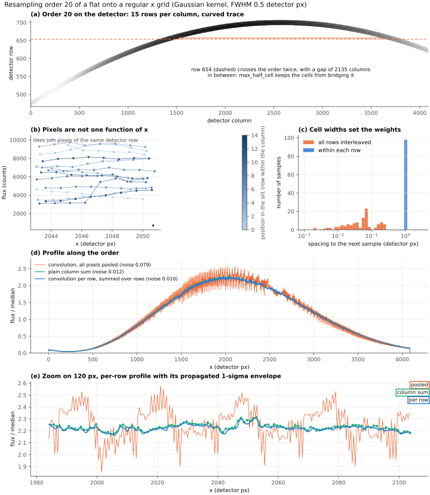

# order_profile

The 1D profile of one order of a flat, built directly from the detector pixels
and their x map, resampled onto a regular grid by convolution with a Gaussian
kernel. Uncertainties are propagated.



*(a) The order on the detector: 15 rows per column along a curved trace.
(b) Around one x, the pixels of different rows sit at very different fluxes,
because each row sees a different part of the slit. (c) The spacing between
neighbouring samples, which sets the weight of each pixel: pooled across rows
it is essentially random, within a row it is one pixel. (d) and (e) The
resulting profiles. Pooling all pixels gives noise at the 8% level; building
the profile row by row matches the plain column sum and is slightly smoother.*

---

## The method

Each detector pixel has an x position (`XMAP`, along the dispersion, tilted
with respect to the columns) and a flux (`PROFILE_AB`). The pixels of one order
are therefore an irregular sampling of x. `convolve_irregular.py` resamples such
data onto a regular grid `x2`:

* every sample owns a cell, from the midpoint with its left neighbour to the
  midpoint with its right one;
* its weight in output pixel `j` is the kernel mass inside its cell,
  `w_ij = CDF(right_i - x2_j) - CDF(left_i - x2_j)`, which is the exact
  convolution of the piecewise-constant interpolant of the data;
* only samples whose cell overlaps the window where the kernel is above
  `1e-6` of its peak are touched (+-5.26 sigma for a Gaussian), so the cost
  scales with the number of output pixels times the samples per kernel;
* errors are propagated, `err_j = sqrt(sum w_ij^2 err_i^2)`. Neighbouring
  output pixels share samples, so their errors are correlated;
  `return_matrix=True` gives the sparse operator `W` (`y2 = W @ y`) for the
  full covariance `W diag(err^2) W^T`.

The kernel is a class with three methods (`profile`, `cdf`, `half_width`), so
any other parametric shape can be dropped in.

## Why the rows must be kept apart

Pooling all the pixels of the order and sorting them in x does not work. At a
given x there are ~15 pixels, one per row, with fluxes that differ by a factor
of up to 6 because they see different parts of the slit (panel b). Pooled, the
cell of each pixel is set by whichever pixel of *another* row happens to fall
next to it, so the cell widths spread from 0.001 to 0.4 pixel (panel c) and so
do the weights. The profile then carries the slit illumination as noise (orange
curves).

The pixels are several interleaved samplings of *different* functions of x,
one per row. With `group=row`, cells are built within each row, where the
spacing is a regular pixel, and `normalize=False` sums the rows instead of
averaging them. The result is the resampled equivalent of a plain column sum.

## Rows that cross the order twice

The trace is curved, so the rows near its apex cross the order twice, once on
each side (panel a, dashed row). Within such a row there is a gap of more than
2000 pixels between the two segments, and the pixels at the edge of the gap
would each claim half of it. Before this was capped, ~57 rows covered each
output pixel instead of 15, and the profile was 27% too bright (median).
`max_half_cell` caps the half-width of a cell, here at 0.75 detector pixel,
which leaves normal cells (half-width 0.5) alone.

## Results on order 20

Noise is the rms of `profile / median` after subtracting a 51-pixel running
median; the output grid has 2 steps per detector pixel and the kernel a FWHM of
0.5 detector pixel.

| profile | high-frequency noise | rows per output pixel | ratio to column sum, 5 / 50 / 95% |
|---|---|---|---|
| convolution, all pixels pooled | 0.079 | n/a | n/a |
| convolution per row, no cap on the cells | 0.0075 (flux spuriously added) | 57 | 0.97 / 1.27 / 1.70 |
| **convolution per row, `max_half_cell`** | **0.0104** | **15** | **0.974 / 0.996 / 1.015** |
| plain column sum | 0.0122 | 15 | 1 |

The per-row profile is slightly smoother than the column sum. The kernel
accounts for part of that, and so does the fact that each output pixel follows
the true x of every pixel rather than the column it happens to sit in.

## Quick start

```bash
pip install numpy scipy astropy matplotlib
python order_profile.py                    # shipped extract of order 20
python order_profile.py flat.fits --order 48 --fwhm 20
```

The full frame (`flatblaze_etienne_20260923.fits`, 557 MB, extensions `XMAP`,
`ORDER_MAP`, `PROFILE_AB`, ...) is too large for the repository. Given that
file, the script extracts the pixels of the requested order into
`orderNN_pixels.fits` (a table of row, column, x and flux) and works from
there. `order20_pixels.fits` (1 MB) is included, so the figure can be rebuilt
from a fresh clone. `--fwhm` is in output pixels, i.e. half-pixels of the
detector.

In your own code:

```python
from convolve_irregular import convolve_irregular

res = convolve_irregular(x, flux, err, x2, fwhm_pix=1.0, group=row,
                         normalize=False, max_half_cell=1.5)
res['y'], res['err'], res['sum_w'], res['coverage']
```

`sum_w` is the effective number of rows covering each output pixel, and
`coverage` the mean fraction of the kernel that is backed by data (pixels
below `min_coverage`, 0.5 by default, are set to NaN).

## Files

| file | content |
|---|---|
| `convolve_irregular.py` | the resampling function and the kernel classes; `python convolve_irregular.py` runs a self-test on synthetic data |
| `order_profile.py` | extraction of an order, the three profiles, the figure |
| `order20_pixels.fits` | the pixels of order 20 |
| `order_profile.pdf`, `order_profile.svg` | the figure |
